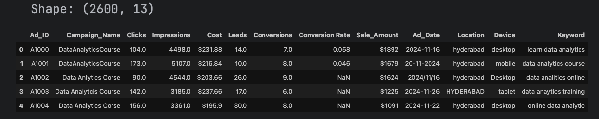
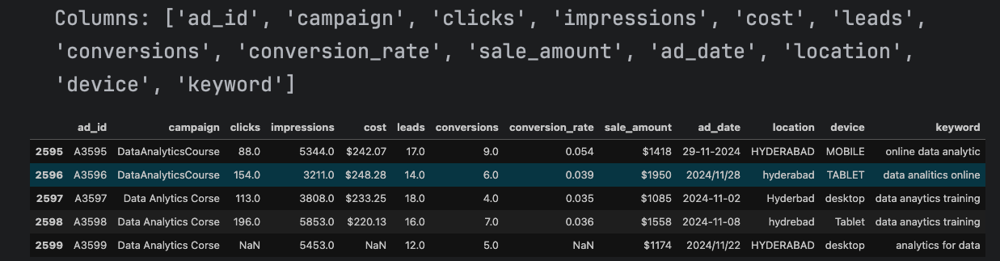
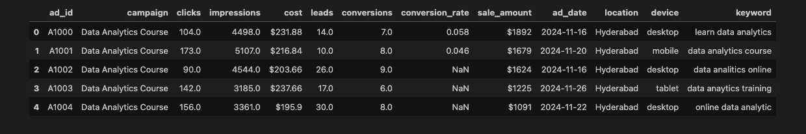
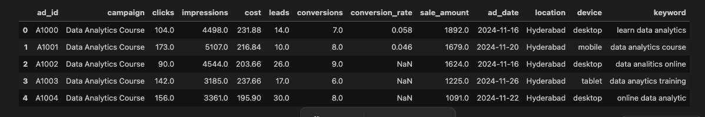
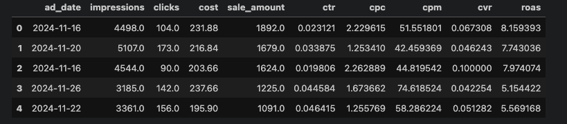
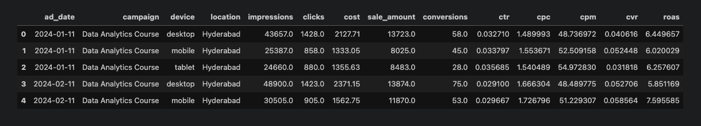
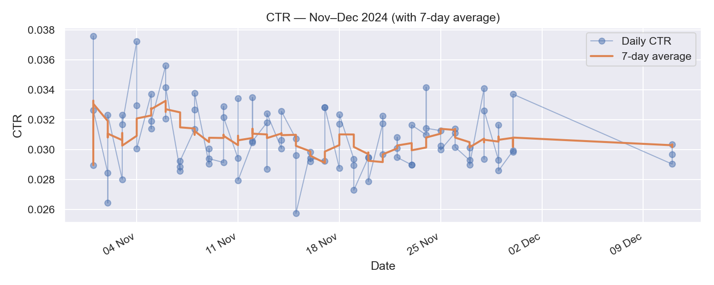

# Google Ads cleaning for beginners — PyCharm notebook

**Before you start**

- Project layout:
```kotlin
googleads-cleaning/
  data/
    raw/
      GoogleAds_DataAnalytics_Sales_Uncleaned.csv
    processed/
  notebooks/
    googleads_cleaning.ipynb
  docs/
    images/
  requirements.txt

```
- (You can create it in the console or manually )
- In PyCharm: In the terminal, create a virtual environment and install
```bash

 pip install jupyter pandas numpy matplotlib seaborn

```
##
## Cell 1 — Imports, settings and file paths

```python

# We import the libraries we need:
# pandas: to load and clean tables
# numpy: to help with numbers and missing values
# matplotlib and seaborn: to make charts
import pandas as pd
import numpy as np
import matplotlib.pyplot as plt
import seaborn as sns

# Nice default style for charts
sns.set_theme(context="notebook", style="whitegrid")

# Make charts a sensible size
plt.rcParams["figure.figsize"] = (10, 5)

# File locations
RAW_PATH = "../data/raw/GoogleAds_DataAnalytics_Sales_Uncleaned.csv"
PROCESSED_PATH = "../data/processed/googleads_daily.csv"
IMG_CTR = "../docs/images/ctr_over_time.png"
IMG_SCATTER = "../docs/images/spend_vs_clicks.png"

```
##
## Cell 2 — Load the CSV and take a quick look

```python

# Read the CSV into a DataFrame called df_raw
# low_memory=False avoids mixed type warnings on big files
df_raw = pd.read_csv(RAW_PATH, low_memory=False)

# Look at the size: (rows, columns)
print("Shape:", df_raw.shape)

# See the first few rows to understand column names and content
df_raw.head()

```

**What we are doing:** simply checking what is inside the file so we can decide which columns to use.
##
## Cell 3 — Make all column names lowercase and rename "conversion rate" → "conversion_rate"
```python

df = df_raw.copy()

# Lowercase all headers
df.columns = [c.strip().lower() for c in df.columns]

# Simple, safe header rename (no row edits)
if "conversion rate" in df.columns:
    df = df.rename(columns={"conversion rate": "conversion_rate"})

print("Columns:", list(df.columns))
df.head()

```


**Why this matters:** consistent names make the rest of the code easier to read and reuse.

## Cell 4 — Tidy text columns (standardise categories)


**Why**: categories like device/network/location/keyword often have extra spaces or mixed case, also in this case we have problem of spelling in campaign_name ; clean them now so groups and charts are accurate.

```python

# 1) Pick text columns to clean if they exist
text_cols = [c for c in ["campaign", "network", "device", "location", "keyword"] if c in df.columns]

# 2) Treat common placeholder tokens as missing values (NaN)
placeholders = {"", " ", "-", "n/a", "na", "none", "null", "(not set)", "(not provided)"}

# 3) Base clean: make strings, trim spaces, replace placeholders with NaN
for c in text_cols:
    # df[c] means "the column named c" (a Series inside df)
    df[c] = (df[c].astype(str)
                  .str.strip()
                  .replace({p: np.nan for p in placeholders}))

# 4) Sensible casing:
#    - device, network, keyword → lower case (e.g. "mobile", "search")
#    - location → Title Case (e.g. "Hyderabad")
#    - campaign → collapse multiple spaces to a single space
if "device"   in df: df["device"]   = df["device"].str.lower()
if "network"  in df: df["network"]  = df["network"].str.lower()
if "keyword"  in df: df["keyword"]  = df["keyword"].str.lower()
if "location" in df: df["location"] = df["location"].str.title()
if "campaign" in df: df["campaign"] = df["campaign"].str.replace(r"\s+", " ", regex=True)

# 5) Standardise your campaign variants → one canonical label (the single official spelling)
#    From your data: 'DataAnalyticsCourse', 'Data Anlytics Corse',
#    'Data Analytcis Course', 'Data Analytics Corse' → we choose "Data Analytics Course"
if "campaign" in df.columns:
    canonical = "Data Analytics Course"  # our chosen official name
    # Build a normalised key to match variants (string → strip → lower → collapse spaces)
    camp_key = (df["campaign"].astype(str)
                              .str.strip()
                              .str.lower()
                              .str.replace(r"\s+", " ", regex=True))
    variants = {
        "dataanalyticscourse",
        "data anlytics corse",
        "data analytcis course",
        "data analytics corse",
        "data analytics course",  # include the correct spelling as well
    }
    # Set campaign to the canonical label wherever the normalised value is in our variant set
    df.loc[camp_key.isin(variants), "campaign"] = canonical

# 6) Location standardisation (handles your Hyderabad spellings)
if "location" in df.columns:
    # Already set to Title Case above; create a lowercased matching key
    loc_key = (df["location"].astype(str)
                            .str.strip()
                            .str.lower()
                            .str.replace(r"\s+", " ", regex=True))
    hyderabad_variants = {"hyderabad", "hyderbad", "hydrebad"}
    df.loc[loc_key.isin(hyderabad_variants), "location"] = "Hyderabad"

# 7) Optional: unify a few device/network synonyms using small replacement dicts
if "device" in df.columns:
    device_map = {"smartphone": "mobile", "phone": "mobile", "computer": "desktop", "pc": "desktop"}
    # map + lambda: replace known synonyms, otherwise keep the original
    df["device"] = df["device"].map(lambda x: device_map.get(x, x))

if "network" in df.columns:
    network_map = {"google search": "search", "content": "display", "video": "youtube"}
    df["network"] = df["network"].map(lambda x: network_map.get(x, x))

# 8) Quick preview of cleaned categories (top values)
for c in ["device", "network", "location", "campaign", "keyword"]:
    if c in df:
        print(f"\nTop {c} values:\n", df[c].value_counts(dropna=False).head(10))

# 9) Drop exact duplicate rows (if any)
before = len(df)
df = df.drop_duplicates()
print(f"\nDropped duplicates: {before - len(df)}")

```
##
## Cell 5 Parse dates

Why: time groupings and line charts only work reliably if dates are true datetimes.

```python

def parse_date(s):
    """Try common formats; fall back to UK-friendly inference."""
    for fmt in ("%Y-%m-%d", "%d/%m/%Y", "%d-%m-%Y", "%m/%d/%Y"):
        try:
            return pd.to_datetime(s, format=fmt)
        except Exception:
            pass
    return pd.to_datetime(s, errors="coerce", dayfirst=True)

# Find a likely date column (now that headers are lowercased)
date_candidates = [c for c in df.columns if c in {"ad_date", "day", "report date", "report_date"}]
if not date_candidates:
    raise ValueError("No date column found. Rename your date column to 'date' or add it to date_candidates.")

df = df.rename(columns={date_candidates[0]: "ad_date"})
df["ad_date"] = df["ad_date"].apply(parse_date)

# Remove rows with invalid dates
df = df.dropna(subset=["ad_date"])
df.head()

```

##
## Cell 6 — Clean numeric fields 

Goal:
Turn money text (like “£1,234.56” or “$2,000”) into numbers, make sure impressions, clicks, conversions are numeric, and remove impossible negatives.
We assume your file already uses the exact column names `cost` and `sale_amount` (because you lowercased and standardised headers in Step 3).


```python

def to_float_money(x):
    """
    Convert money-like text into a numeric (float).
    Examples:
      "£1,234.56" -> 1234.56
      "$2,000"    -> 2000.0
      " 300 "     -> 300.0
    If it can't be converted (e.g. empty or non-numeric), return NaN (missing).
    """
    # 1) Missing stays missing
    if pd.isna(x):
        return np.nan

    # 2) Turn value into a string and remove clutter: spaces, commas, currency symbols
    s = str(x).strip()
    for ch in ["£", "$", ",", " "]:
        s = s.replace(ch, "")

    # 3) Try to parse as float
    try:
        return float(s)
    except:
        # If parsing fails (e.g. "not available"), mark as NaN
        return np.nan


# A) Make sure integer-like metrics are really numeric
#    - errors="coerce" converts bad values (like "N/A") to NaN instead of crashing.
for col in ["impressions", "clicks", "conversions"]:
    if col in df.columns:
        df[col] = pd.to_numeric(df[col], errors="coerce")

# B) Clean the money columns using our helper
#    These must already exist from earlier steps (lowercased headers).
if "cost" in df.columns:
    df["cost"] = df["cost"].apply(to_float_money)

if "sale_amount" in df.columns:
    df["sale_amount"] = df["sale_amount"].apply(to_float_money)

# C) Keep rows that have the bare minimum to analyse (date + activity)
#    If impressions/clicks are missing, there isn’t much we can do with the row.
must_have = [c for c in ["date", "impressions", "clicks"] if c in df.columns]
df = df.dropna(subset=must_have)

# D) Guardrail: no negative values for these fields in ad data.
#    If any slip through (data entry error), mark them missing instead of using them.
for c in ["impressions", "clicks", "conversions", "cost", "sale_amount"]:
    if c in df.columns:
        df.loc[df[c] < 0, c] = np.nan


# --- Quick sanity checks  ---

# 1) Show the dtypes so you can confirm numbers really are numeric (int/float)
print("\nColumn types after cleaning:")
print(df.dtypes)

# 2) Glance at ranges to see if values look sensible
for c in ["impressions", "clicks", "conversions", "cost", "sale_amount"]:
    if c in df.columns:
        print(f"\n{c}: count={df[c].count()}, min={df[c].min()}, max={df[c].max()}")


```

##
## Cell 7 — Compute KPIs, add ROAS

**Why**: These are standard paid media metrics used to understand performance.

```python

# KPI definitions (proportions and rates are 0..1 unless you choose to show as % in charts):
# CTR  (Click-Through Rate)     = clicks / impressions
# CPC  (Cost Per Click)         = cost / clicks
# CPM  (Cost Per Mille)         = (cost / impressions) * 1000
# CVR  (Conversion Rate)        = conversions / clicks
# ROAS (Return On Ad Spend)     = sale_amount / cost

if {"clicks","impressions"}.issubset(df.columns):
    df["ctr"] = np.where(df["impressions"]>0, df["clicks"]/df["impressions"], np.nan)

if {"cost","clicks"}.issubset(df.columns):
    df["cpc"] = np.where(df["clicks"]>0, df["cost"]/df["clicks"], np.nan)

if {"cost","impressions"}.issubset(df.columns):
    df["cpm"] = np.where(df["impressions"]>0, df["cost"]/df["impressions"]*1000, np.nan)

if {"conversions","clicks"}.issubset(df.columns):
    df["cvr"] = np.where(df["clicks"]>0, df["conversions"]/df["clicks"], np.nan)

if {"sale_amount","cost"}.issubset(df.columns):
    df["roas"] = np.where(df["cost"]>0, df["sale_amount"]/df["cost"], np.nan)

df[["ad_date"] + [c for c in ["impressions","clicks","cost","sale_amount","ctr","cpc","cpm","cvr","roas"] if c in df.columns]].head()

```
##


## Cell 8 - Aggregate to daily (and optional breakouts)

**Why aggregate to daily?**

- Clarity: multiple rows per day (e.g. per keyword/device) can hide the trend; daily totals reveal it.

- Stability: daily KPIs smooth small fluctuations and make comparisons easier week-over-week.

- De-duplication: if the export contains repeated lines, grouping collapses them.

- Reporting: stakeholders usually expect daily views and rollups.

**What we’ll do:**

1. Choose the grouping keys (always ad_date, plus optional breakouts if those columns exist).

2. Build an aggregation map to sum numeric metrics.

3. Run groupby(...).agg(...) to produce the daily table.

4. Recompute KPIs on the totals (CTR/CPC/CPM/CVR/ROAS).

5. Optional sanity checks.

```python

# 1) GROUP KEYS
# Always group by ad_date; then add any optional breakdowns that exist in your DataFrame.
group_keys = ["ad_date"]
for opt in ["campaign", "network", "device", "location"]:
    if opt in df.columns:
        group_keys.append(opt)

# 2) WHAT TO SUM
# Build a dictionary telling pandas how to combine each metric.
# 'sum' makes sense for these (totals for the day).
agg_map = {}
for c in ["impressions", "clicks", "cost", "sale_amount", "conversions"]:
    if c in df.columns:
        agg_map[c] = "sum"

# 3) GROUP + AGGREGATE
# - groupby(group_keys, as_index=False): make groups by the keys, keep them as normal columns.
# - .agg(agg_map): apply the 'sum' operation per group for the listed metrics.
daily = df.groupby(group_keys, as_index=False).agg(agg_map)

# 4) RECOMPUTE KPIs ON TOTALS
# KPIs should be calculated on the aggregated values (not averaged row-by-row),
# because CTR/CPC/CPM/CVR/ROAS are ratios that depend on totals.
if {"clicks", "impressions"}.issubset(daily.columns):
    daily["ctr"] = np.where(daily["impressions"] > 0,
                            daily["clicks"] / daily["impressions"], np.nan)

if {"cost", "clicks"}.issubset(daily.columns):
    daily["cpc"] = np.where(daily["clicks"] > 0,
                            daily["cost"] / daily["clicks"], np.nan)

if {"cost", "impressions"}.issubset(daily.columns):
    daily["cpm"] = np.where(daily["impressions"] > 0,
                            daily["cost"] / daily["impressions"] * 1000, np.nan)

if {"conversions", "clicks"}.issubset(daily.columns):
    daily["cvr"] = np.where(daily["clicks"] > 0,
                            daily["conversions"] / daily["clicks"], np.nan)

if {"sale_amount", "cost"}.issubset(daily.columns):
    daily["roas"] = np.where(daily["cost"] > 0,
                             daily["sale_amount"] / daily["cost"], np.nan)

# 5) OPTIONAL: order the table for readability and do a quick check
daily = daily.sort_values(group_keys)
print("Daily rows:", len(daily))
daily.head()

```

**What those pandas bits mean**

- `groupby(group_keys, as_index=False)`: “Bundle” all rows that share the same `ad_date` (and any optional keys) into groups; keep the keys as normal columns (not as an index).

- `agg(agg_map)`: For each group, sum the selected columns (impressions, clicks, cost, sale_amount, conversions).

- Recompute KPIs on the summed values: ratios like CTR and ROAS are correct when calculated on totals, not by averaging per-row ratios.
##
## Cell 9- Plot 1 — **CTR over time**

```python

# CTR over time
plt.figure(figsize=(10, 4))
plt.plot(daily["ad_date"], daily["ctr"], marker="o", linewidth=1)
plt.title("CTR over time")
plt.xlabel("Date")
plt.ylabel("CTR")
plt.tight_layout()
plt.savefig(IMG_CTR, dpi=150)
plt.show()

```

- Beacuse is really noise in the last two month we are goin to drill a bit :

```python

# 1) Pick the date window you want to drill into
start = "2024-11-01"
end   = "2024-12-31"

# 2) Filter the daily table to that window and keep it in order
sub = (daily.loc[(daily["ad_date"] >= start) & (daily["ad_date"] <= end)]
            .sort_values("ad_date")
            .copy())

# 3) Create a 7-day rolling average of CTR
#    Why 7? It smooths weekday/weekend noise while still reacting quickly to changes.
#    min_periods=1 means the first few days will still show an average (based on the data available so far).
sub["ctr_ma7"] = sub["ctr"].rolling(7, min_periods=1).mean()

# 4) Plot the daily CTR (faint) and the smoothed trend (bold)
import matplotlib.dates as mdates
fig, ax = plt.subplots(figsize=(10, 4))

# Daily points: semi-transparent so the trend line stands out
ax.plot(sub["ad_date"], sub["ctr"], marker="o", linewidth=1, alpha=0.5, label="Daily CTR")

# 7-day average: thicker line for an easy-to-read trend
ax.plot(sub["ad_date"], sub["ctr_ma7"], linewidth=2, label="7-day average")

# 5) Make the x-axis readable: weekly ticks, short labels like "04 Nov"
ax.xaxis.set_major_locator(mdates.WeekdayLocator(byweekday=mdates.MO))
ax.xaxis.set_major_formatter(mdates.DateFormatter("%d %b"))
fig.autofmt_xdate()  # tilt labels so they don't overlap

# 6) Titles, labels, legend and layout
ax.set_title("CTR — Nov–Dec 2024 (with 7-day average)")
ax.set_xlabel("Date")
ax.set_ylabel("CTR")
ax.legend()
plt.tight_layout()
plt.show()

# (Optional) Save it alongside the other images
# fig.savefig("../docs/images/ctr_zoom_nov_dec.png", dpi=150)

```
##
## Cell 10 **Spend vs Clicks**
**Why**: see whether higher spend is associated with more clicks.

```python

if {"cost", "clicks"}.issubset(daily.columns):
    plt.figure(figsize=(6, 5))
    plt.scatter(daily["cost"], daily["clicks"], alpha=0.7)
    plt.title("Spend vs Clicks")
    plt.xlabel("Spend (cost)")
    plt.ylabel("Clicks")
    plt.tight_layout()
    plt.savefig(IMG_SCATTER, dpi=150)
    plt.show()
else:
    print("Cost or clicks not available to plot.")


```
##
## Cell 11 - Save the cleaned daily CSV
**Why:** Reuse the output in dashboards or future notebooks
```python

Path(PROCESSED_PATH).parent.mkdir(parents=True, exist_ok=True)
daily.to_csv(PROCESSED_PATH, index=False)
print("Saved to:", PROCESSED_PATH)

```
##
# How to present the three plots (what, why, and business value)
## 1) CTR over time (full period)

**What it shows:** overall engagement trend—how often people click after seeing our ads across the whole dataset.

**Why it’s useful:** highlights seasonality, campaign launches, landing-page or creative shifts, and tracking glitches.

**What to say (example):**
“CTR rose steadily through spring, dipped in July (likely seasonal), and improved after the mid-September creative refresh. The spike on 05 May aligns with our new headline test.”

**Actions it informs:**

- Double down on creatives and audiences used during high-CTR periods.

- Investigate drops (page speed, ad fatigue, audience mismatch, policy issues).

- Plan tests around weeks where CTR historically underperforms.

## CTR Nov–Dec with 7-day average (drill-down)

**What it shows:** a clean view of the late-year trading period, smoothing noise so you can see real movements.

**Why it’s useful:** Black Friday/holiday periods are volatile; the smoothed line helps spot sustained improvements or issues (e.g. creative fatigue, bid changes, competitor pressure).

**What to say (example):**
“CTR climbs into Black Friday week, then plateaus in early December. The 7-day trend confirms the uplift is sustained, not a one-day spike.”
Actions it informs:

- Time creative refreshes just after the trend dips, not mid-upswing.

- Adjust bids/placements early when the trend shows persistent decline.

- Share the smoothed view with stakeholders—much easier to align decisions than raw daily noise.

## 2) Spend vs Clicks (scatter)

**What it shows:** how clicks scale with spend—are we buying more clicks as we invest more, and where do returns flatten?

**Why it’s useful:** reveals efficiency and diminishing returns; helps set budgets and pacing.

**What to say (example):**

“As spend rises, clicks increase up to ~£400/day; beyond that, returns flatten—suggesting saturation at current targeting and bids.”
Actions it informs:

- Reallocate budget from high-spend/low-gain days to more responsive days or platforms.

- Test broader audiences, new keywords, or higher quality scores to push out the saturation point.

- Pair with CPC/ROAS to prioritise the most efficient spend.

